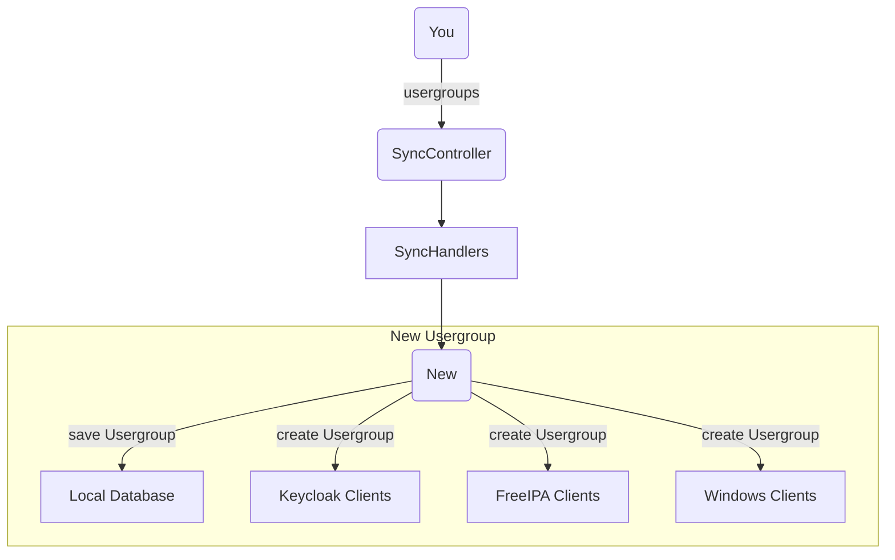
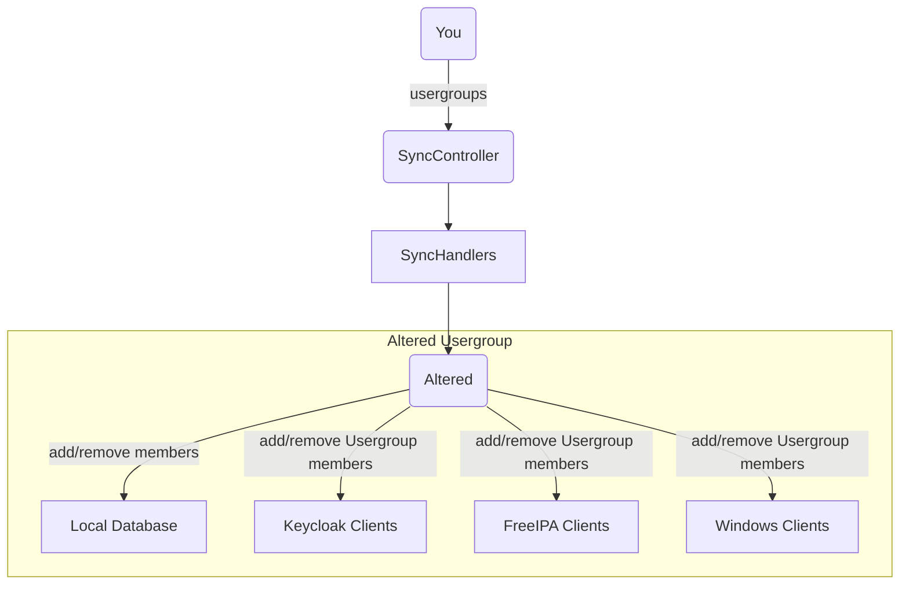
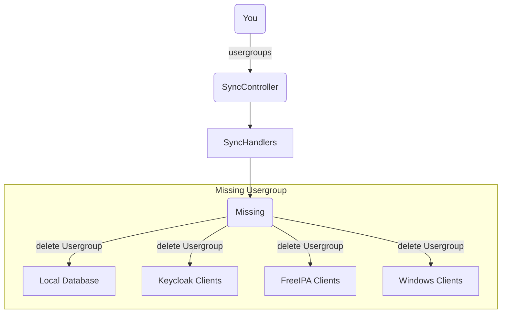
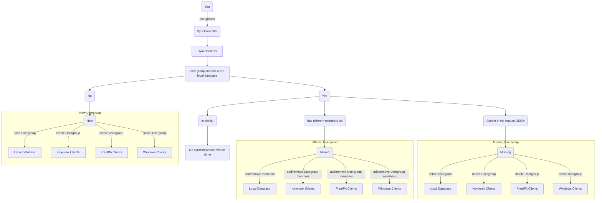

## Synchronization

#### Sync flow
**New user groups**

A user group from the JSON list given in a sync request will be considered new
if it's not present in the local database of the service.  

For new user groups, the synchronization flow is as simple as:

**Altered user groups**

A user group from the JSON list given in a sync request will be considered altered
if it's present in the local database of the service, but its list of users(members) is different.

The synchronization flow will reflect additions and removals of user group users(members):

**Missing user groups**

A user group from the JSON list given in a sync request will be considered missing
if it's present in the local database of the service, but is missing in the JSON list of user group given in the request.

The synchronization flow will reflect deletions of the user groups:

#### Overall Sync flow
